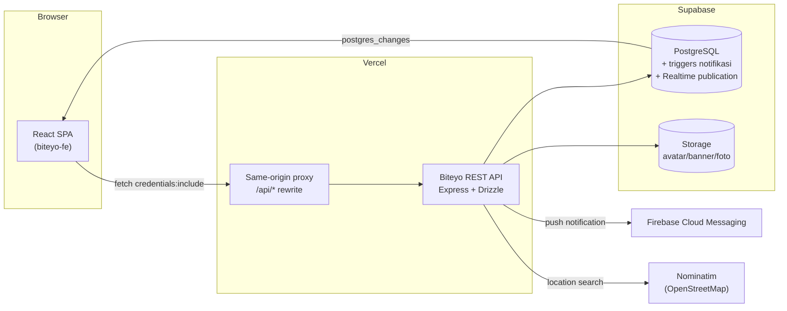

# Biteyo Backend

[](https://github.com/ltnzz/biteyo-be/actions/workflows/backend-tests.yml)


REST API untuk **Biteyo** — aplikasi sosial berbagi rekomendasi makanan. Menangani autentikasi, feed bite, engagement (like/comment/save), profil & follow, notifikasi + push FCM, upload media, dan pencarian lokasi.

> 📖 **Dokumentasi API interaktif**: [`/api/docs`](https://biteyo-be.vercel.app/api/docs) (Swagger UI, JSON mentah di `/api/docs.json`)
>
> 🎨 **Frontend**: [biteyo-fe](https://github.com/ltnzz/biteyo-fe) · 🌐 **Live**: [www.biteyo.my.id](https://www.biteyo.my.id/)
>
> 🏗️ Keputusan arsitektur & trade-off: lihat [ARCHITECTURE.md](./ARCHITECTURE.md)

## Arsitektur



Poin kunci:

- **Cookie-only auth** — JWT hanya hidup di cookie `httpOnly`; frontend tidak pernah menyimpan token.
- **Same-origin proxy** — frontend memanggil `/api/*` di domainnya sendiri; Vercel meneruskan ke backend. Cookie menjadi first-party dan CORS tidak jadi isu lintas-site.
- **DB triggers own notification rows** — record notifikasi like/comment/follow/mention ditulis trigger PostgreSQL; backend hanya mengirim push FCM (`sendNotificationPush`).

## Fitur

- Autentikasi signup/signin/logout dengan JWT di cookie HTTP-only, login Google ID token, forgot/reset password via email.
- Feed bite: foto, lokasi, rating, kategori (`street_food`, `cafe`, `fine_dining`, `dessert`, `viral`, `hidden_gems`), review, tab **Semua / Following**.
- Trending berbasis viral score `views×1 + likes×3 + comments×5` (konsisten dengan functional index di DB).
- Like, save, komentar, mention `@username` dengan notifikasi + push.
- Notifikasi real-time via Supabase Realtime + FCM push.
- Profil: bio, avatar, banner, follow/unfollow, saved & liked bites, grafik aktivitas posting bulanan.
- Share bite dengan Open Graph preview (route publik `/api/feed/share/:id`).
- Pencarian lokasi (Nominatim) dengan cache LRU + timeout.
- Upload avatar/banner/foto ke Supabase Storage (diproses Sharp), file ikut terhapus saat bite dihapus.

## Teknis

| Aspek | Implementasi |
|---|---|
| Validasi request | Zod via middleware `validate` |
| Rate limiting | `express-rate-limit` pada endpoint Maps |
| Counter engagement | Trigger inkremental O(1) (bukan `COUNT(*)`) |
| Observability | Logger JSON-lines + request-id middleware (`X-Request-Id`) |
| Migrasi | Runner sendiri dengan tracking tabel `_migrations` |
| CI | Gitleaks (secret scan) · unit test · integration test dengan Postgres service |

## Tech Stack

Node.js (ES Modules) · Express 5 · PostgreSQL 16 · Drizzle ORM · Supabase (Storage) · Firebase Admin (FCM) · Nodemailer · Google Auth Library · Zod · Multer + Sharp

## Struktur Folder

```txt
src/
  config/          Konfigurasi Supabase & Firebase Admin
  controllers/     Lapisan HTTP tipis (parse -> service -> response)
  services/        Business logic per domain (feedQuery, engagement, comment, biteMutation)
  db/              Drizzle schema & koneksi
  docs/            OpenAPI document (/api/docs)
  middlewares/     Auth (cookie-only), upload, validasi
  routes/          Express routes
  templates/       Template email
  utils/           logger, mention, notification/push, storage, scheduler
scripts/
  run-migrations.mjs   Migration runner (--seed-history untuk DB lama)
drizzle/          File migration SQL (0000-0015)
tests/
  contract.test.js                  Uji kontrak API tanpa DB
  integration/                      Uji engagement/notifikasi dengan DB nyata
  smoke.cookie-auth.mjs             Smoke test alur cookie
.github/workflows/                 CI: gitleaks + unit + integration (Postgres service)
```

## Menjalankan Project

```bash
# 1. Install dependency
npm install

# 2. Salin .env.example -> .env, isi nilainya
cp .env.example .env

# 3. Jalankan migration ke database
npm run db:migrate

# 4. Development server
npm run dev        # http://localhost:8000
```

### Environment Variable

| Variabel | Wajib | Keterangan |
|---|---|---|
| `DATABASE_URL` | ✅ | Connection string Postgres (Supabase) |
| `SUPABASE_URL` / `SUPABASE_SERVICE_ROLE_KEY` | ✅ | Akses Storage |
| `JWT_SECRET` | ✅ | Signing token sesi |
| `CLIENT_URL` | ✅ | URL frontend (untuk redirect & link share) |
| `CLIENT_URLS` | ➖ | Origin tambahan untuk CORS (comma-separated) |
| `EMAIL_USER` / `EMAIL_PASS` | ➖ | Kirim email reset password |
| `GOOGLE_CLIENT_ID` | ➖ | Verifikasi login Google |
| `FIREBASE_SERVICE_ACCOUNT_PATH` / `FIREBASE_SERVICE_ACCOUNT_KEY` | ➖ | Kredensial FCM (file lokal / string JSON untuk produksi) |
| `CRON_SECRET` | ➖ | Header auth webhook bot harian |
| `START_INTERNAL_CRON` | ➖ | `true` = jalankan scheduler in-process (default `false`) |
| `LOG_LEVEL` | ➖ | `debug\|info\|warn\|error` (default mengikuti NODE_ENV) |

## Testing

```bash
npm test                # contract tests (tanpa DB)
npm run test:integration  # engagement/notification vs database nyata
node tests/smoke.cookie-auth.mjs  # smoke alur auth cookie
```

Integration test butuh `DATABASE_URL` yang sudah di-migrate. Di CI, job `integration`
menjalankan Postgres 16 sebagai service, apply migration, lalu menjalankan suite.

## Endpoint Utama

Total **39 endpoint** — dokumentasi lengkap & interaktif di [`/api/docs`](https://biteyo-be.vercel.app/api/docs).

| Grup | Jumlah | Contoh |
|---|---|---|
| Auth | 7 | `POST /api/auth/signup`, `GET /api/auth/me` |
| Feed | 15 | `GET /api/feed/bites?scope=following`, `POST /api/feed/bites/:id/like`, `GET /api/feed/share/:id` |
| Profile | 11 | `GET /api/profile/:username`, `GET /api/profile/:username/activity` |
| Notifications | 5 | `DELETE /api/notifications/:id`, `PATCH /api/notifications/:id/read` |
| Maps | 1 | `GET /api/maps/location/search` |

## Database & Migration

Migration SQL di folder `drizzle/` (bernama `0000_...sql` dst.) dijalankan lewat runner
yang mencatat riwayat di tabel `_migrations`:

```bash
npm run db:migrate                       # apply yang belum jalan
node scripts/run-migrations.mjs --seed-history  # daftarkan riwayat untuk DB lama tanpa eksekusi
```

Notifikasi like/comment/follow dibuat oleh **trigger database**
(`0006_supabase_phase1.sql`, `0013_mention_notification_triggers.sql`);
counter like/comment disinkronkan trigger inkremental (`0015`).
